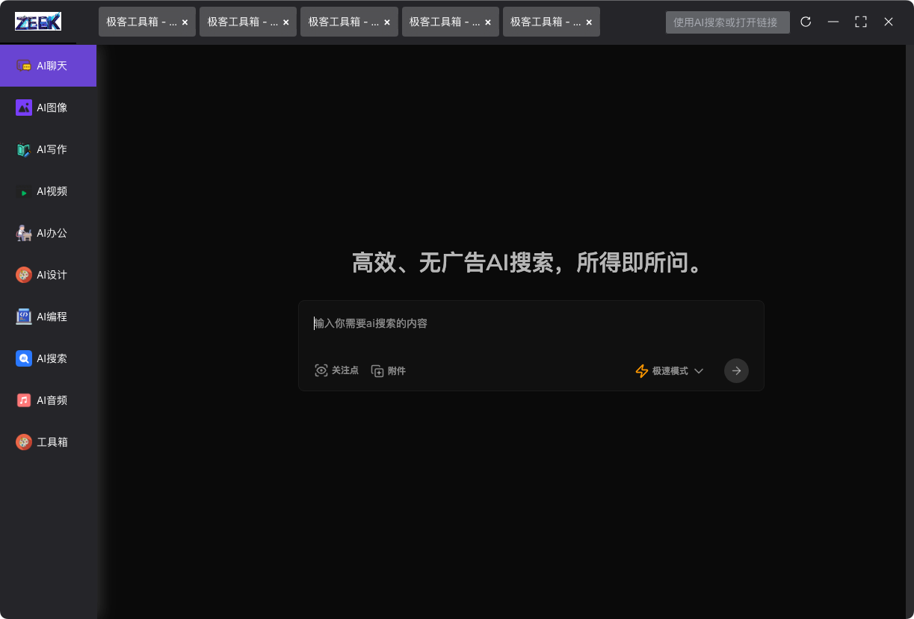
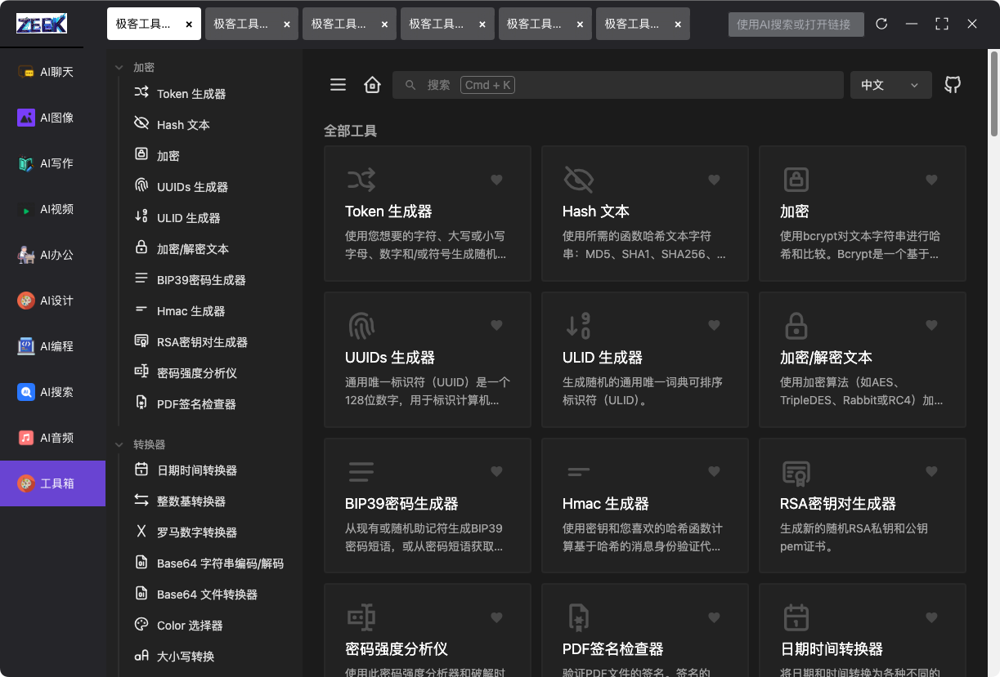

# 🚀 Zeek.ai Desktop App


[中文](https://github.com/zeeklog/zeek.ai/blob/master/Readme.CN.md) ｜ [English](https://github.com/zeeklog/zeek.ai/blob/master/Readme.md)


**Zeek.ai** 是一款基于 **Electron** 和 **Vite** 
打造的跨平台(支持 Windows、macOS 和 Linux) AI 浏览器。
集成了 **SearXNG AI 搜索**、开发工具集合、
市面上最流行的 AI 工具门户，以及代码编写和桌面快捷工具等功能，
通过模块化的 Monorepo 架构，提供轻量级、可扩展且高效的桌面体验，
助力 AI 驱动的日常工作流程。

[](https://github.com/zeeklog/zeek.ai/stargazers)
[](https://github.com/zeeklog/zeek.ai/network)
[](https://github.com/zeeklog/zeek.ai/issues)
[](https://github.com/zeeklog/zeek.ai/blob/main/LICENSE)
[](https://github.com/zeeklog/zeek.ai/releases)
[](https://github.com/zeeklog/zeek.ai/actions)


## 🛠️ 技术栈

- **核心**: [Electron](https://www.electronjs.org/) (主进程) + [Vite](https://vitejs.dev/) & [Vue 3](https://vuejs.org/) (渲染器)
- **样式**: [Unocss](https://unocss.dev/) - 轻量级原子 CSS 引擎
- **界面**: [Element Plus](https://element-plus.org/) - Vue 3 组件库
- **状态管理**: [Pinia](https://pinia.vuejs.org/)
- **工具**: [Lodash](https://lodash.com/) - 数据操作工具包
- **测试**: [Playwright](https://playwright.dev/) - 端到端测试
- **更新**: [Electron-Updater](https://www.electron.build/electron-updater) - 无缝自动更新

---

## 📂 项目结构

Zeek.ai 在 `packages/` 下采用 **Monorepo** 架构，以实现模块化和可扩展性：

| 模块                    | 描述                                | 技术栈                      |
|-------------------------|-----------------------------------|-----------------------------|
| `packages/main`         | Electron 主进程：窗口管理、IPC 和应用生命周期     | Node.js, Electron           |
| `packages/renderer`     | 支持快速集成三方应用，UI 渲染器，包含核心 UI 和工具的子模块 | Vue 3, Vite, Element Plus   |
| `packages/preload`      | 预加载脚本，安全桥接主进程和渲染器                 | Node.js, Electron           |
| `packages/electron-version` | 管理 Electron 版本兼容性                 | Node.js                     |
| `packages/integrate-renderer` | 自动化渲染器集成，用于构建和开发环境                | Vite, 自定义脚本            |

### 渲染器子模块
- **`renderer/basic`**: 核心 UI 框架，支持 AI 工具执行  
  
- **`renderer/tools`**: 可扩展工具和插件  
  

---

## ✨ 功能亮点

- **跨平台**: 通过 Electron Builder 支持 `Windows、macOS 和 Linux`
- **热重载**: 开发模式下主进程和渲染器实时更新
- **模块化设计**: Monorepo 结构，便于功能扩展
- **自动更新**: 内置在线更新系统，基于 `Electron Updater`
- **性能**: Vite 优化的构建带来轻量级体验
- **快速集成**：支持`快速集成三方应用`（当前仅提供`链接入口`上架）和`内置应用`（`/packages/renderer/`下）

---

## ⚙️ 快速入门

### 前提条件
- **Node.js**: >= 20.0.0
- **操作系统**: Windows, macOS 或 Linux

### 安装
```bash
# 克隆仓库
git clone https://github.com/zeeklog/zeek.ai.git

# 进入项目目录
cd zeek.ai
# Install dependencies
npm install
# or you can use pnpm install
pnpm install
```


### Development

# Start dev server (main + renderer)
npm run dev
Main app launches with Electron
Renderer available at http://localhost:5173
# Build
### Build for Windows
```bash
npm run build:win
```

### Build for macOS
```bash
npm run build:mac
```

### Build for Linux
```bash
npm run build:linux
```
# 📜 脚本

| 命令                   | 描述                              |
|------------------------|-----------------------------------|
| `npm run dev`          | 启动开发模式，支持热重载          |
| `npm run build`        | 构建所有模块的生产版本            |
| `npm run build:win`    | 打包 Windows 版本                |
| `npm run build:mac`    | 打包 macOS 版本                  |
| `npm run build:linux`  | 打包 Linux 版本                  |
| `npm run test`         | 运行端到端测试                   |
| `npm run create-renderer` | 创建新的渲染器模块             |
| `npm run integrate`    | 将渲染器集成到 Electron 应用     |

# 📦 发布

- **最新版本**: [v0.1.1](https://github.com/zeeklog/zeek.ai/releases/tag/v0.1.1) (2025年4月)
- **支持格式**:
  - **Windows**: NSIS 安装包
  - **macOS**: DMG (已签名)
  - **Linux**: DEB (系统工具类别)

通过 `electron-updater` 启用自动更新。查看 [releases](https://github.com/zeeklog/zeek.ai/releases) 获取更新日志和二进制文件。

---

# 🤝 贡献

我们欢迎贡献！以下是参与方式：

1. Fork 仓库
2. 创建功能分支 (`git checkout -b feature/xyz`)
3. 提交更改 (`git commit -m "Add XYZ"`)
4. 推送到你的 Fork (`git push origin feature/xyz`)
5. 提交 [Pull Request](https://github.com/zeeklog/zeek.ai/pulls)
6. Issues [报告 Bug](https://github.com/zeeklog/zeek.ai/issues/new)

---

# 🌐 社区

- **网站**: [zeeklog.com](https://zeeklog.com)
- **支持**: [GitHub Issues](https://github.com/zeeklog/zeek.ai/issues)
- **邮箱**: [001@zeeklog.com](mailto:001@zeeklog.com)

---

# 📄 许可证

 采用 [MIT 许可证](https://github.com/zeeklog/zeek.ai/blob/main/LICENSE) 开源，欢迎自由使用、修改和分发！

---

# 🙌 致谢

- 由 [Neo](https://zeeklog.com) 用 ❤️ 构建
- 感谢开源社区提供的工具，如 Electron、Vite 和 Vue, 以及项目中使用的众多但未提及的开源工具、库、代码等。
