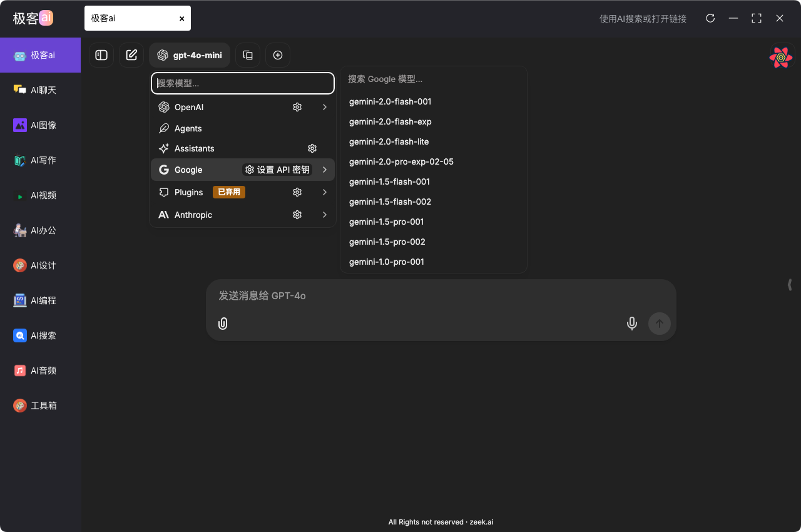

# 🚀 Zeek.ai Desktop App


[中文](https://github.com/zeeklog/zeek.ai/blob/master/Readme.md) ｜ [English](https://github.com/zeeklog/zeek.ai/blob/master/Readme.EN.md)


**Zeek.ai** is a desktop client that supports for multiple LLM providers, available on Windows, Mac and Linux. Leveraging a modular Monorepo architecture, it delivers a lightweight, extensible, and high-performance desktop experience for AI-driven workflows.

[](https://github.com/sindresorhus/awesome)
[](https://github.com/zeeklog/zeek.ai/stargazers)
[](https://github.com/zeeklog/zeek.ai/network)
[](https://github.com/zeeklog/zeek.ai/issues)
[](https://github.com/zeeklog/zeek.ai/blob/main/LICENSE)
[](https://github.com/zeeklog/zeek.ai/releases)


## 💪 FN Under Development
- Supports the configuration for connecting to various AI agents, such as ChatGPT, Grok, Kimi, Ollama, etc.
- Supports connection to model suppliers.
- Supports model switching, and also supports functions like text-to-image, image-to-text, text-to-video, etc.
- Supports video painting.

### Ai search

### Ai agent for Popular supplier


## 📊 Key Metrics

- **Downloads**: [releases](https://github.com/zeeklog/zeek.ai/releases)
- **Open Issues**: [](https://github.com/zeeklog/zeek.ai/issues)
- **Pull Requests**: [](https://github.com/zeeklog/zeek.ai/pulls)
- **Last Commit**: [](https://github.com/zeeklog/zeek.ai/commits/main)
- **Contributors**: [](https://github.com/zeeklog/zeek.ai/graphs/contributors)

---

## 🛠️ Tech Stack

- **Core**: [Electron](https://www.electronjs.org/) + [Vite](https://vitejs.dev/) & [Vue 3](https://vuejs.org/)
- **Styling**: [Unocss](https://unocss.dev/) - Lightweight, atomic CSS engine
- **UI**: [Element Plus](https://element-plus.org/) - Vue 3 component library
- **State Management**: [Pinia](https://pinia.vuejs.org/)
- **Utilities**: [Lodash](https://lodash.com/) - Data manipulation toolkit
- **Testing**: [Playwright](https://playwright.dev/) - End-to-end testing
- **Updates**: [Electron-Updater](https://www.electron.build/electron-updater) - Seamless auto-updates

---

## 📂 Project Structure

Zeek.ai uses a **Monorepo** architecture under `packages/` for modularity and scalability:

| Module                        | Description                                                              | Tech Stack                |
|-------------------------------|--------------------------------------------------------------------------|---------------------------|
| `packages/main`               | Electron main process: Window management, IPC, and app lifecycle         | Node.js, Electron         |
| `packages/renderer`           | UI renderer with submodules for core UI and tools                        | Vue 3, Vite, Element Plus |
| `packages/preload`            | Preload scripts bridging main and renderer securely                      | Node.js, Electron         |
| `packages/electron-version`   | Manages Electron version compatibility                                   | Node.js                   |
| `packages/integrate-renderer` | Automates renderer integration for builds and dev                        | Vite, Custom Scripts      |
| `packages/chat`               | Ai agent chat, support a lot of supplier. (Mix Component from LibreChat) | React                     |

### Renderer Submodules
- **`renderer/basic`**: Core UI framework with AI tool execution  
  
- **`renderer/tools`**: Extensible tools and plugins  
  
- **`renderer/chat`**: Extensible ai agent


---

## ✨ Features

- **Cross-Platform**: Windows, macOS, Linux support via Electron Builder
- **Multi Agent Support**: Support multi agent like: grok/chatgpt
- **Hot Reloading**: Real-time updates for main and renderer in dev mode
- **Modular Design**: Monorepo structure for easy feature expansion
- **Auto Updates**: Built-in online update system with Electron Updater
- **Performance**: Lightweight footprint with Vite’s optimized builds

---

## ⚙️ Getting Started

### Prerequisites
- **Node.js**: >= 20.0.0
- **OS**: Windows, macOS, or Linux

### Installation
- please use `pnpm`
```bash
# Clone the repository
git clone https://github.com/zeeklog/zeek.ai.git

# Navigate to the project
cd zeek.ai

# Install dependencies
npm install --legacy-peer-deps
# or you want to use pnpm
pnpm install
```

### Development

# Start dev server (main + renderer)
npm run dev
Main app launches with Electron
Renderer available at http://localhost:5173
# Build
### Build for Windows
```bash
npm run build:win
```

### Build for macOS
```bash
npm run build:mac
```

### Build for Linux
```bash
npm run build:linux
```

# 📜 Scripts
| Command                | Description                          |
|------------------------|--------------------------------------|
| `npm run dev`          | Start dev mode with hot reloading    |
| `npm run build`        | Build all modules for production     |
| `npm run build:win`    | Package for Windows                  |
| `npm run build:mac`    | Package for macOS                    |
| `npm run build:linux`  | Package for Linux                    |
| `npm run test`         | Run E2E tests                        |
| `npm run create-renderer` | Scaffold a new renderer module    |
| `npm run integrate`    | Integrate renderer into Electron app |
# 📦 Releases

- **Latest Release**: [v1.1.0](https://github.com/zeeklog/zeek.ai/releases/tag/v1.1.0) (April 2025)
- **Supported Formats**:
  - **Windows**: NSIS Installer
  - **macOS**: DMG (Signed)(MAC intel chip is not supporting.)
  - **Linux**: DEB (System Tools Category)

Auto-updates are enabled via `electron-updater`. Check [releases](https://github.com/zeeklog/zeek.ai/releases) for changelogs and binaries.

---

# 🤝 Contributing

We welcome contributions! Here’s how to get involved:

1. Fork the repo
2. Create a feature branch (`git checkout -b feature/xyz`)
3. Commit changes (`git commit -m "Add XYZ"`)
4. Push to your fork (`git push origin feature/xyz`)
5. Open a [Pull Request](https://github.com/zeeklog/zeek.ai/pulls)
6. Issues: [Report a bug](https://github.com/zeeklog/zeek.ai/issues/new)


---

# 🌐 Community

- **Website**: [zeeklog.com](https://zeeklog.com)
- **Support**: [GitHub Issues](https://github.com/zeeklog/zeek.ai/issues)
- **Email**: [001@zeeklog.com](mailto:001@zeeklog.com)
  
# 🚀 Contributors

<a href="https://github.com/zeeklog/zeek.ai/graphs/contributors">
  
</a>
<br />

---

# 📄 License

Zeek.ai is licensed under the [MIT License](https://github.com/zeeklog/zeek.ai/blob/main/LICENSE). Feel free to use, modify, and distribute!

---

# 🙌 Acknowledgments

- Built with ❤️ by [Neo](https://zeeklog.com)
- Thanks to the open-source community for providing tools such as Electron, Vite, and Vue, as well as the numerous unmentioned open-source tools, libraries, code, and more used in the project.
