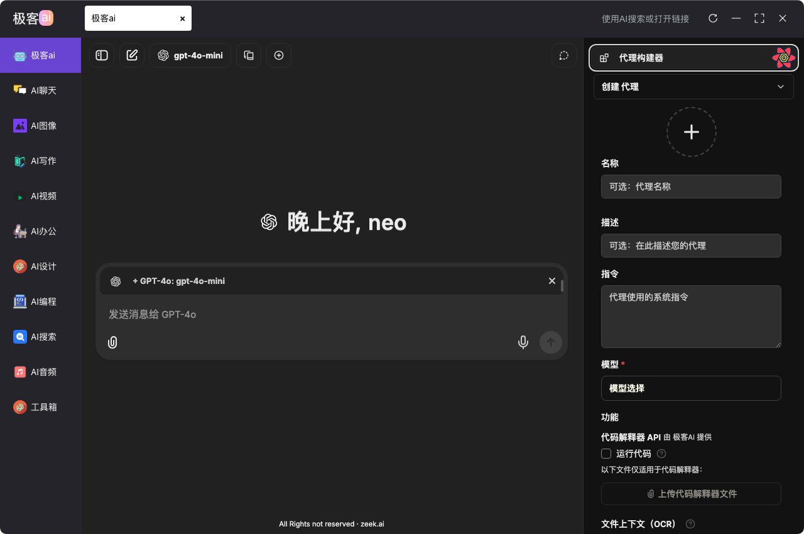
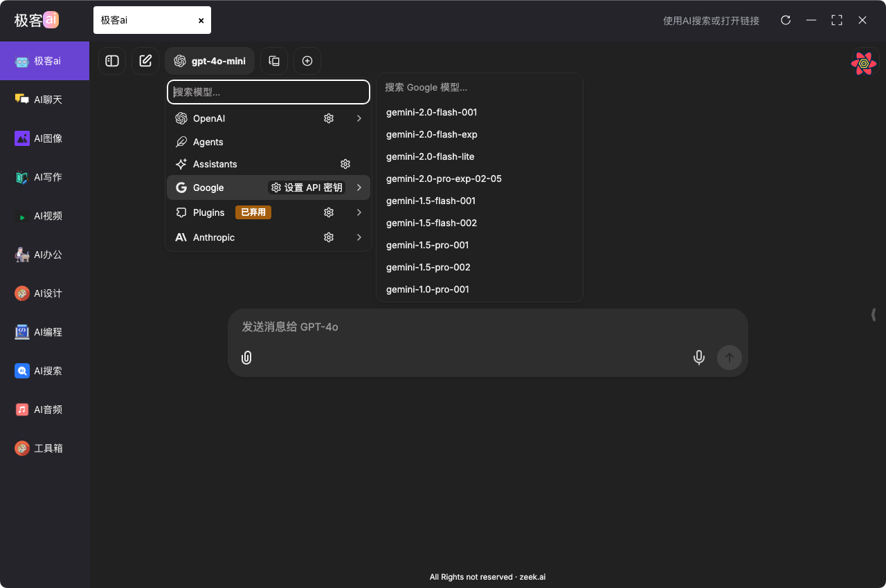

# 🚀 Zeek.ai 桌面应用程序

[中文](https://github.com/zeeklog/zeek.ai/blob/master/Readme.md) ｜ [English](https://github.com/zeeklog/zeek.ai/blob/master/Readme.EN.md)

**Zeek.ai** 是一款支持多种大语言模型（LLM）提供商的桌面客户端，适用于 Windows、Mac 和 Linux。采用。模块模块化的 Monorepo 架构，提供架构，提供轻量级、可扩展且高性能的桌面体验，助力 AI 驱动的工作流程。

[](https://github.com/sindresorhus/awesome)
[](https://github.com/zeeklog/zeek.ai/stargazers)
[](https://github.com/zeeklog/zeek.ai/network)
[](https://github.com/zeeklog/zeek.ai/issues)
[](https://github.com/zeeklog/zeek.ai/blob/main/LICENSE)
[](https://github.com/zeeklog/zeek.ai/releases)

## 💪 正在开发的功能
- 支持配置连接多种 AI 代理，如 ChatGPT、Grok、Kimi、Ollama 等。
- 支持连接模型供应商。
- 支持模型切换，以及文本转图片、图片转文本、文本转视频等功能。
- 支持视频绘画。

### AI 搜索

### 主流供应商的 AI 代理


## 📊 关键指标

- **下载量**：[releases](https://github.com/zeeklog/zeek.ai/releases)
- **开放问题**：[](https://github.com/zeeklog/zeek.ai/issues)
- **拉取请求**：[](https://github.com/zeeklog/zeek.ai/pulls)
- **最后提交**：[](https://github.com/zeeklog/zeek.ai/commits/main)
- **贡献者**：[](https://github.com/zeeklog/zeek.ai/graphs/contributors)

---

## 🛠️ 技术栈

- **核心**：[Electron](https://www.electronjs.org/) + [Vite](https://vitejs.dev/) & [Vue 3](https://vuejs.org/)
- **样式**：[Unocss](https://unocss.dev/) - 轻量级原子 CSS 引擎
- **UI**：[Element Plus](https://element-plus.org/) - Vue 3 组件库
- **状态管理**：[Pinia](https://pinia.vuejs.org/)
- **工具库**：[Lodash](https://lodash.com/) - 数据操作工具包
- **测试**：[Playwright](https://playwright.dev/) - 端到端测试
- **更新**：[Electron-Updater](https://www.electron.build/electron-updater) - 无缝自动更新

---

## 📂 项目结构

Zeek.ai 采用 **Monorepo** 架构，位于 `packages/` 下，具有模块化和可扩展性：

| 模块                          | 描述                                                                     | 技术栈                    |
|-------------------------------|--------------------------------------------------------------------------|---------------------------|
| `packages/main`               | Electron 主进程：窗口管理、IPC 和应用生命周期                           | Node.js, Electron         |
| `packages/renderer`           | UI 渲染器，包含核心 UI 和工具子模块                                     | Vue 3, Vite, Element Plus |
| `packages/preload`            | 预加载脚本，安全连接主进程和渲染器                                       | Node.js, Electron         |
| `packages/electron-version`   | 管理 Electron 版本兼容性                                                 | Node.js                   |
| `packages/integrate-renderer` | 自动化渲染器集成，用于构建和开发                                         | Vite, 自定义脚本          |
| `packages/chat`               | AI 代理聊天，支持多家供应商（混合 LibreChat 组件）                       | React                     |

### 渲染器子模块
- **`renderer/basic`**：核心 UI 框架，包含 AI 工具执行  
  
- **`renderer/tools`**：可扩展工具和插件  
  
- **`renderer/chat`**：可扩展 AI 代理  
  

---

## ✨ 功能特性

- **跨平台**：通过 Electron Builder 支持 Windows、macOS、Linux
- **多代理支持**：支持多种代理，如 Grok、ChatGPT
- **热重载**：开发模式下主进程和渲染器实时更新
- **模块化设计**：Monorepo 结构便于功能扩展
- **自动更新**：内置在线更新系统，基于 Electron Updater
- **性能**：Vite 优化的构建提供轻量级体验

---

## ⚙️ 快速开始

### 前置条件
- **Node.js**：>= 20.0.0
- **操作系统**：Windows、macOS 或 Linux

### 安装
- 开发环境请使用`pnpm`作为包管理器
```bash
# 克隆仓库
git clone https://github.com/zeeklog/zeek.ai.git

# 进入项目目录
cd zeek.ai

# 安装依赖
npm install --legacy-peer-deps
# 或者使用 pnpm
pnpm install
