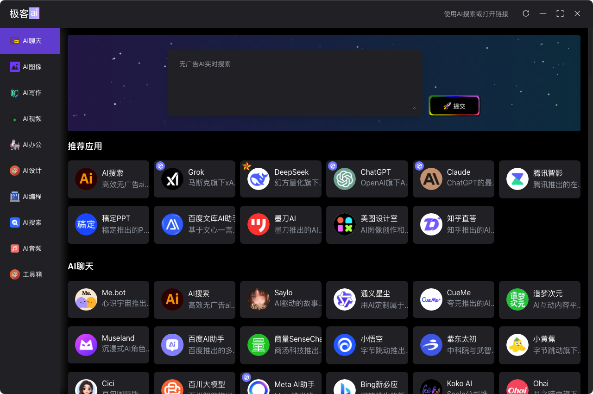

# Zeek.ai Desktop App
`
Term of use: 使用本项目代码即代表同意【反对美国野蛮关税压迫行径】
`

[中文](https://github.com/zeeklog/zeek.ai/blob/master/Readme.CN.md) ｜ [English](https://github.com/zeeklog/zeek.ai/blob/master/Readme.md)

**Zeek Desktop** is a cutting-edge, cross-platform AI-powered browser built with **Electron** and **Vite**. Leveraging a modular Monorepo architecture, it delivers a lightweight, extensible, and high-performance desktop experience for AI-driven workflows.

[](https://github.com/zeeklog/zeek.ai/stargazers)
[](https://github.com/zeeklog/zeek.ai/network)
[](https://github.com/zeeklog/zeek.ai/issues)
[](https://github.com/zeeklog/zeek.ai/blob/main/LICENSE)
[](https://github.com/zeeklog/zeek.ai/releases)





---

## 🚀 Project Overview

- **Name**: Zeek Desktop
- **Version**: 0.0.1
- **Website**: [zeeklog.com](https://zeeklog.com)
- **Author**: Neo ([001@zeeklog.com](mailto:001@zeeklog.com)) | [zeeklog.com](https://zeeklog.com)
- **Repository**: [github.com/zeeklog/zeek-desktop](https://github.com/zeeklog/zeek.ai)

Zeek Desktop empowers users with a fast, modular AI browser experience, built for developers, researchers, and power users.

---

## 📊 Key Metrics

- **Downloads**: [Coming Soon](#releases)
- **Open Issues**: [](https://github.com/zeeklog/zeek-desktop/issues)
- **Pull Requests**: [](https://github.com/zeeklog/zeek-desktop/pulls)
- **Last Commit**: [](https://github.com/zeeklog/zeek-desktop/commits/main)
- **Contributors**: [](https://github.com/zeeklog/zeek-desktop/graphs/contributors)

---

## 🛠️ Tech Stack

- **Core**: [Electron](https://www.electronjs.org/) (Main Process) + [Vite](https://vitejs.dev/) & [Vue 3](https://vuejs.org/) (Renderer)
- **Styling**: [Unocss](https://unocss.dev/) - Lightweight, atomic CSS engine
- **UI**: [Element Plus](https://element-plus.org/) - Vue 3 component library
- **State Management**: [Pinia](https://pinia.vuejs.org/)
- **Utilities**: [Lodash](https://lodash.com/) - Data manipulation toolkit
- **Testing**: [Playwright](https://playwright.dev/) - End-to-end testing
- **Updates**: [Electron-Updater](https://www.electron.build/electron-updater) - Seamless auto-updates

---

## 📂 Project Structure

Zeek Desktop uses a **Monorepo** architecture under `packages/` for modularity and scalability:

| Module                  | Description                                                                 | Tech Stack                  |
|-------------------------|-----------------------------------------------------------------------------|-----------------------------|
| `packages/main`         | Electron main process: Window management, IPC, and app lifecycle            | Node.js, Electron           |
| `packages/renderer`     | UI renderer with submodules for core UI and tools                           | Vue 3, Vite, Element Plus   |
| `packages/preload`      | Preload scripts bridging main and renderer securely                         | Node.js, Electron           |
| `packages/electron-version` | Manages Electron version compatibility                                  | Node.js                     |
| `packages/integrate-renderer` | Automates renderer integration for builds and dev                    | Vite, Custom Scripts        |

### Renderer Submodules
- **`renderer/basic`**: Core UI framework with AI tool execution  
  
- **`renderer/tools`**: Extensible tools and plugins  
  

---

## ✨ Features

- **Cross-Platform**: Windows, macOS, Linux support via Electron Builder
- **Hot Reloading**: Real-time updates for main and renderer in dev mode
- **Modular Design**: Monorepo structure for easy feature expansion
- **Auto Updates**: Built-in online update system with Electron Updater
- **Performance**: Lightweight footprint with Vite’s optimized builds

---

## ⚙️ Getting Started

### Prerequisites
- **Node.js**: >= 20.0.0
- **OS**: Windows, macOS, or Linux

### Installation
```bash
# Clone the repository
git clone https://github.com/zeeklog/zeek-desktop.git

# Navigate to the project
cd zeek-desktop

# Install dependencies
npm install --legacy-peer-deps
# or you want to use pnpm
pnpm install
```

### Development

# Start dev server (main + renderer)
npm run dev
Main app launches with Electron
Renderer available at http://localhost:5173
# Build
### Build for Windows
```bash
npm run build:win
```

### Build for macOS
```bash
npm run build:mac
```

### Build for Linux
```bash
npm run build:linux
```

# 📜 Scripts
| Command                | Description                          |
|------------------------|--------------------------------------|
| `npm run dev`          | Start dev mode with hot reloading    |
| `npm run build`        | Build all modules for production     |
| `npm run build:win`    | Package for Windows                  |
| `npm run build:mac`    | Package for macOS                    |
| `npm run build:linux`  | Package for Linux                    |
| `npm run test`         | Run E2E tests                        |
| `npm run create-renderer` | Scaffold a new renderer module    |
| `npm run integrate`    | Integrate renderer into Electron app |
# 📦 Releases

- **Latest**: [v0.0.1](https://github.com/zeeklog/zeek-desktop/releases/tag/v0.0.1) (April 2025)
- **Supported Formats**:
  - **Windows**: NSIS Installer
  - **macOS**: DMG (Signed)
  - **Linux**: DEB (System Tools Category)

Auto-updates are enabled via `electron-updater`. Check [releases](https://github.com/zeeklog/zeek-desktop/releases) for changelogs and binaries.

---

# 🤝 Contributing

We welcome contributions! Here’s how to get involved:

1. Fork the repo
2. Create a feature branch (`git checkout -b feature/xyz`)
3. Commit changes (`git commit -m "Add XYZ"`)
4. Push to your fork (`git push origin feature/xyz`)
5. Open a [Pull Request](https://github.com/zeeklog/zeek-desktop/pulls)

- **Issues**: [Report a bug](https://github.com/zeeklog/zeek-desktop/issues/new)
- **Guidelines**: See [CONTRIBUTING.md](https://github.com/zeeklog/zeek-desktop/blob/main/CONTRIBUTING.md)

---

# 🌐 Community

- **Website**: [zeeklog.com](https://zeeklog.com)
- **Support**: [GitHub Issues](https://github.com/zeeklog/zeek-desktop/issues)
- **Email**: [001@zeeklog.com](mailto:001@zeeklog.com)
- **Discussions**: [GitHub Discussions](https://github.com/zeeklog/zeek-desktop/discussions)

---

# 📄 License

Zeek Desktop is licensed under the [MIT License](https://github.com/zeeklog/zeek-desktop/blob/main/LICENSE). Feel free to use, modify, and distribute!

---

# 🙌 Acknowledgments

- Built with ❤️ by [Neo](https://zeeklog.com)
- Thanks to the open-source community for providing tools such as Electron, Vite, and Vue, as well as the numerous unmentioned open-source tools, libraries, code, and more used in the project.
